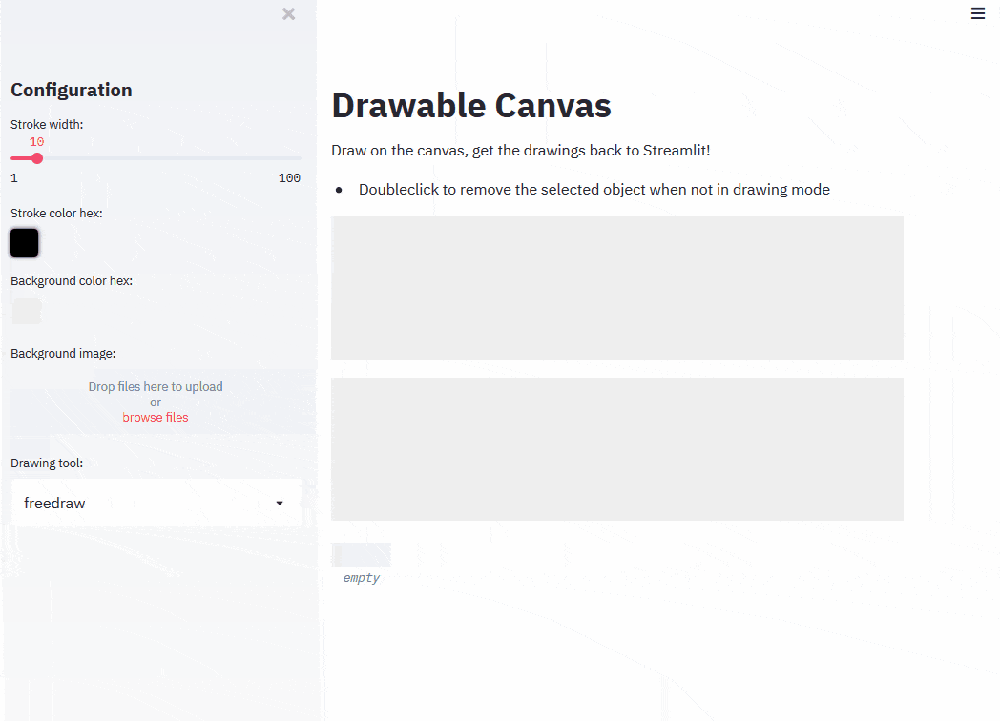

# Streamlit - Drawable Canvas

A Streamlit custom component for a free drawing canvas with [Fabric.js](http://fabricjs.com/).



## Installation

```shell script
pip install -i https://test.pypi.org/simple/ streamlit-drawable-canvas
```

## Example Usage

```python
import streamlit as st
from streamlit_drawable_canvas import st_canvas

# Specify brush parameters and drawing mode
b_width = st.sidebar.slider("Brush width: ", 1, 100, 10)
b_color = st.sidebar.beta_color_picker("Enter brush color hex: ")
bg_color = st.sidebar.beta_color_picker("Enter background color hex: ", "#eee")
drawing_mode = st.sidebar.checkbox("Drawing mode ?", True)

# Create a canvas component
image_data = st_canvas(
    b_width, b_color, bg_color, height=150, drawing_mode=drawing_mode, key="canvas"
)

# Do something interesting with the image data
if image_data is not None:
    st.image(image_data)
```

## Development 

### Install

* JS side

```shell script
cd frontend
npm install
```

* Python side 

```shell script
conda create -n streamlit-drawable-canvas python=3.7
conda activate streamlit-drawable-canvas
pip install streamlit-0.61.0-py2.py3-none-any.whl
pip install -e .
```

### Run

Both webpack dev server and Streamlit should run at the same time.

* JS side

```shell script
cd frontend
npm run start
```

* Python side

```shell script
streamlit run app.py
```

## References 

* [React hooks - fabric](https://github.com/fabricjs/fabric.js/issues/5951#issuecomment-563427231)